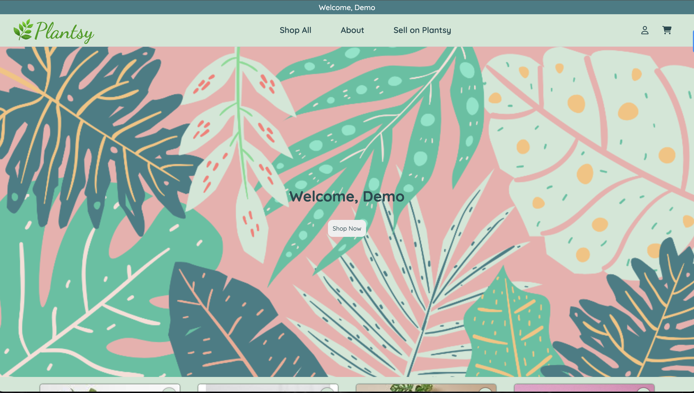
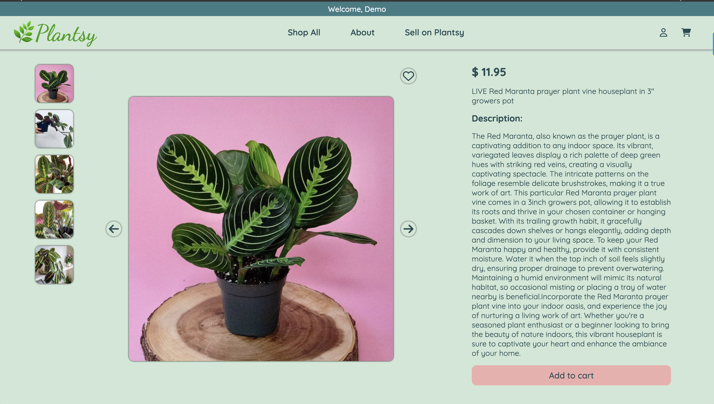
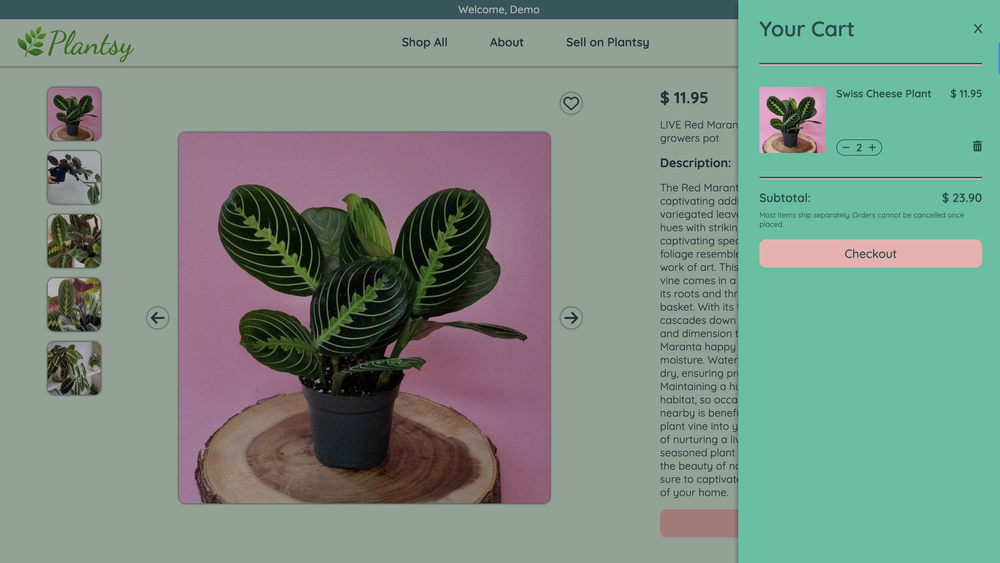
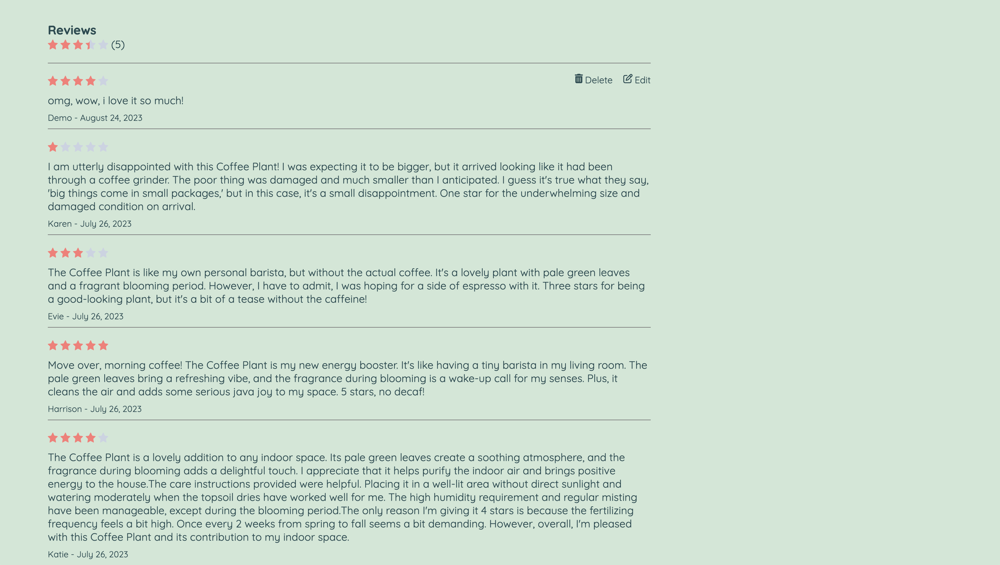

# Plantsy

## Overview
* This is a website app that allows users to sell and purchase plants. It provides a platform for plant enthusiasts to connect, discover new plants, and engage in transactions.

* Here is a link to the live demo: https://plantsy-11s0.onrender.com/

### Built With

<!-- TODO: List any MAJOR libraries/frameworks (e.g. React, Tailwind) with links to their homepages. -->
 * React: https://react.dev/
 * Redux: https://redux.js.org/
 * SQAlchemy: https://www.sqlalchemy.org/
 * Flask: https://flask.palletsprojects.com/en/2.3.x/
 * WTForms: https://wtforms.readthedocs.io/en/3.0.x/

## App

## Features
* Creating listings to sell plants: Users can create listings to showcase plants they want to sell. They can provide details such as plant name, description, price, and images.
* Reviewing purchased plants: Users can leave reviews and ratings for plants they have purchased. This allows them to share their experience and provide feedback to other users.
* Adding purchases to a cart: Users can add plants to their cart while browsing and proceed to checkout later.
* Favoriting plants: Users can mark plants as favorites to easily access them later.

## Contact
  * Katie Piele:
    * LinkedIn: https://www.linkedin.com/in/katie-piele/
    * GitHub: https://github.com/KatiePee/Plantsy